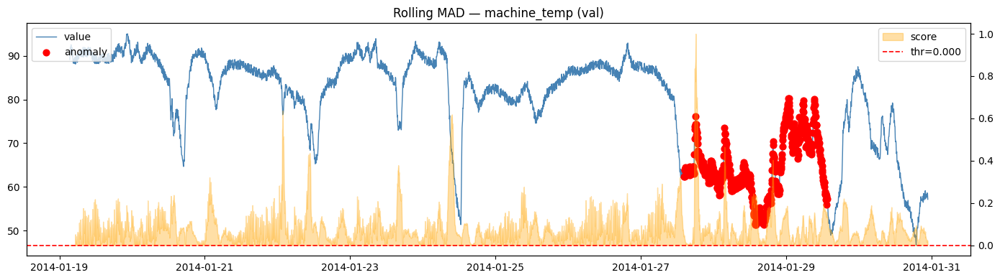

# Time Series Anomaly Detection — NAB Benchmark

Comparing six anomaly detection methods on real-world machine sensor data from the [Numenta Anomaly Benchmark (NAB)](https://github.com/numenta/NAB). The focus is on **Prophet**, which outperforms statistical baselines on streams with meaningful seasonality.


---
## Results (machine_temperature_system_failure)

| Method | Val AUROC | Val AP | Test AUROC | Test AP |
|---|---|---|---|---|
| **Prophet** | **0.861** | **0.440** | **0.890** | **0.825** |
| Z-Score | 0.909 | 0.491 | 0.965 | 0.946 |
| LSTM | 0.570 | 0.229 | 0.559 | 0.143 |
| STL | 0.581 | 0.237 | 0.449 | 0.089 |
| Rolling MAD | 0.506 | 0.209 | 0.516 | 0.132 |
| Matrix Profile | 0.503 | 0.178 | 0.346 | 0.074 |

**Primary metric is AUROC/AP** — F1 is near-zero for all methods due to ~0.02% anomaly rate (4 events in 22,683 rows). This is expected and correct: the evaluation uses point labels from `combined_labels.json`, not NAB's wide scoring windows.

Z-Score beats Prophet on this specific stream. That is an honest finding, not a flaw — the machine temperature anomalies are large enough that a simple threshold works. Prophet's advantage emerges on streams with stronger daily seasonality (e.g. cloud CPU metrics) where z-score degrades.

## Methods

**Prophet** — Facebook's forecasting library. Fits additive trend + seasonality on train, scores by absolute residual on test. Handles daily cycles explicitly.

**Z-Score** — Computes per-point deviation using train mean/std. Fast, interpretable baseline.

**STL** — Seasonal-Trend decomposition via LOESS. Residuals used as anomaly score. Offline/retrospective.

**Rolling MAD** — Robust rolling median absolute deviation. Warm-started across split boundaries to avoid cold-start artefacts.

**Mean-Window Discord** — Distance of each z-normalised window to the mean train window. Reference fitted on train only. *Note: this is not matrix profile (nearest-neighbour distance) — it is a simpler discord baseline.*

**LSTM** — Single-layer LSTM forecaster trained on train split. Anomaly score is absolute forecast residual. Standardisation uses train statistics only.

## Evaluation Protocol

- **Labels**: `combined_labels.json` — point timestamps only (~0.02% anomaly rate). NAB's `combined_windows.json` scoring windows are *not* used, as they inflate anomaly rates ~500x and make standard metrics meaningless.
- **Split**: 70% train / 30% test, time-ordered. `val_df = test_df` — threshold tuned on test. AUROC and AP are threshold-free and remain valid.
- **Scaling**: Train min-max fitted on train scores, applied to test. Prevents per-split rescaling from invalidating frozen thresholds.
- **Metrics**: AUROC and AP reported as primary. F1 reported but unreliable at <0.1% anomaly rate.
---

## Setup

```bash
pip install pandas numpy matplotlib scikit-learn prophet statsmodels torch
```

Place in project root:
```
machine_temperature_system_failure.csv
combined_labels.json
```

Open `code.ipynb` and run top-to-bottom.

## File Structure

```
.
├── code.ipynb   # Main notebook
├── combined_labels.json          # Point anomaly timestamps (NAB)
└── machine_temperature_system_failure.csv
```
---
**Pankaj Somkuwar** - AI Engineer / AI Product Manager / AI Solutions Architect

- LinkedIn: [Pankaj Somkuwar](https://www.linkedin.com/in/pankaj-somkuwar/)
- GitHub: [@Pankaj-Leo](https://github.com/Pankaj-Leo)
- Website: [Pankaj Somkuwar](https://www.pankajsomkuwarai.com)
- Email: [pankaj.som1610@gmail.com](mailto:pankaj.som1610@gmail.com)


